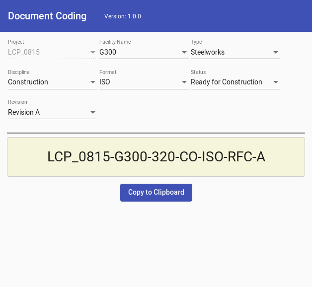

# Document Coding - client description

## For what is it good for?

The DC-Client provides a simple UI to generate document codes (or document names) for 
documents (or files). It is a pretty common requirement in large captial projects to 
generate consistent document/file names which follow certain rules. This application helps
the user to accomplish this task. 

The DC-Client is a generic UI which requires a rules-server that provides a JSON structure 
which describes how the document code is generated. 
 

## How to use it?

### Projects

Often document codes are specific for certain projects (engineering projects). The client 
provides a URL to list projects:

The client URL is:

    http://client-server.com/projects
  
The client makes a GET call to 

    http://server.com/projects
    
and expects a JSON response.

Example of the expected JSON response:

    {
      projects: [
        {
          name: 'LCP_1234',
          id: '1234',
          shortDescription: 'Dark Moon',
          description: 'Major expansion project for ABC'
        },
        {
          name: 'LCP_5678',
            id: '5678'
        },
        {
          name: 'LCP_ABCD',
            id: 'ABCD'
        }
      ]
    };

The attributes shortDescription and description are optional. The id attribute is used to 
build the client URL for document coding page, see next section.

### Document Codes

The client URL is:

    http://client-server.com/project/id

where 'id' is the project identifier which is provided to the content server via a GET call.

Therefore the client makes a GET call to 

    http://server.com/project/:id
 
end expects a JSON response.

Example of the expected JSON response:

    {
      segments: [
        {
          name: 'PROJECT',
          displayName: 'Project',
          fixed: true,
          entries: [
            {
              name: 'LCP_0815',
              value: 'LCP_0815',
              id: 0
            }
          ]
        },
        {
          name: 'FACILITY',
          displayName: 'Facility Name',
          entries: [
            {
              name: 'K-200',
              value: 'K-200',
              id: 0,
              filters: [
                {
                  segment: 'TYPE',
                  allowedIds: [1]
                },
                {
                  segment: 'DISCIPLINE',
                  allowedIds: [3]
                }
              ]
            },
            {
              name: 'G-300',
              value: 'G-300',
              id: 0
            }
          ]
        },
        {
          name: 'TYPE',
          displayName: 'Type',
          entries: [
            {
              name: 'Plot-Plan',
              value: '200',
              id: 0,
            },
            {
              name: 'ISBL',
              value: '300',
              id: 0
            },
            {
              name: 'Steelworks',
              value: '320',
              id: 1,
              filters: [
                {
                  segment: 'DISCIPLINE',
                  allowedIds: [1]
                }
              ]
            },
            {
              name: 'Powergrids',
              value: '400',
              id: 2,
              filters: [
                {
                  segment: 'DISCIPLINE',
                  allowedIds: [2]
                }
              ]
            }
          ]
        },
        {
          name: 'DISCIPLINE',
          displayName: 'Discipline',
          entries: [
            {
              name: 'Civil',
              value: 'CI',
              id: 1
            },
            {
              name: 'Electrical',
              value: 'EI',
              id: 2
            },
            {
              name: 'Construction',
              value: 'CO',
              id: 1
            },
            {
              name: 'Project Management',
              value: 'PM',
              id: 0
            }
          ]
        },
        {
          name: 'FORMAT',
          displayName: 'Format',
          entries: [
            {
              name: 'PDF',
              value: 'PDF',
              id: 3
            },
            {
              name: 'XML',
              value: 'XML',
              id: 3
            },
            {
              name: 'ISO',
              value: 'ISO',
              id: 1
            },
            {
              name: 'XLS',
              value: 'XLS',
              id: 0
            }
          ]
        },
        {
          name: 'STATUS',
          displayName: 'Status',
          entries: [
            {
              name: 'Ready for Procurement',
              value: 'RFP',
              id: 0
            },
            {
              name: 'Ready for Construction',
              value: 'RFC',
              id: 0
            },
            {
              name: 'Ready for Detail Design',
              value: 'RFD',
              id: 0
            },
          ]
        },
        {
          name: 'REVISION',
          displayName: 'REVISION',
          entries: [
            {
              name: 'Revision A',
              value: 'A',
            },
            {
              name: 'Revision B',
              value: 'B',
            },
            {
              name: 'Revision C',
              value: 'C',
            },
            {
              name: 'Revision D',
              value: 'D',
            }
          ]
        },
        {
          name: 'NUMBER',
          displayName: 'Number',
          type: 'FIELD',
          pattern: '\\d{1,2}_\\d{1,2}',
          required: true
        },        
      ]
    };

Basically the structure describes a set of code segments from which the overall 
document code is derived. 

### Code segments

Each code segment has a name, a display name and a type. Allowed types are:
LIST and FIELD. 

#### Closed List (type LIST)
A closed list code segment has a set of entries. Each entry can hold a 
filter which limits the available entries at subsequent code list segments.

The filter works more or less like this:

* entries with an ID of 0 pass a filter always
* otherwise only those values which match all filters are displayed

Which segment a filters modifies is defined via the "segment" attribute of a filter.
The array "allowedIds" contains all allowed IDs for the entries within the 
referenced segment. Which subsequent segment shall be filtered is defined via the 
segment attribute which must hold the name of the targeted segment.

The filter mechanism is flexible but can lead to unexpected results :D

Note that the ID of an entry has NO special meaning for the client besides: 

* an ID of 0 passes a filter always
* the ID should match with the filter definitions
* the ID should be an integer value.

__Note that entries without an ID get the default ID value of 0.__

To a add a code segment with a fixed value to all generated document codes just add the
attribute "fixed:true" to the segment.

To improve performance for large entry lists you can disable filtering by 
setting the attribute "filtered:false" at a segment.

To further improve performance you can set the attribute "filtering:false" at the segment. 
This will stop the segment to cause any filter updates on subsequent segments. 
__Should not be set on segments which contain at least on entry with a filter.__ 

#### Free Text Field (type FIELD)

A free text code segment does not add any filters. You must define a pattern and 
you can defined the segment as required.

### Worth to know

The client can send a "beacon" (= a http GET request) to a configured endpoint to enable to 
usage statistics of the service. Besides the standard HTTP information no other information is
provided to the beacon server. 

Most of the configuration is done in the 'environments' folder.

## Versions

* 1.0.0 - initial version
* 1.0.1 - add better filter management
* 1.1.0 - add project list
* 1.1.1 - add free text field

 
